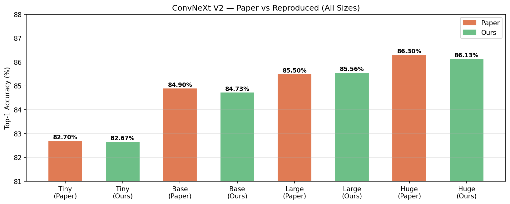
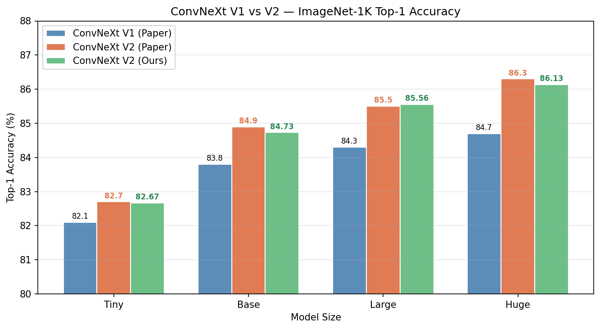
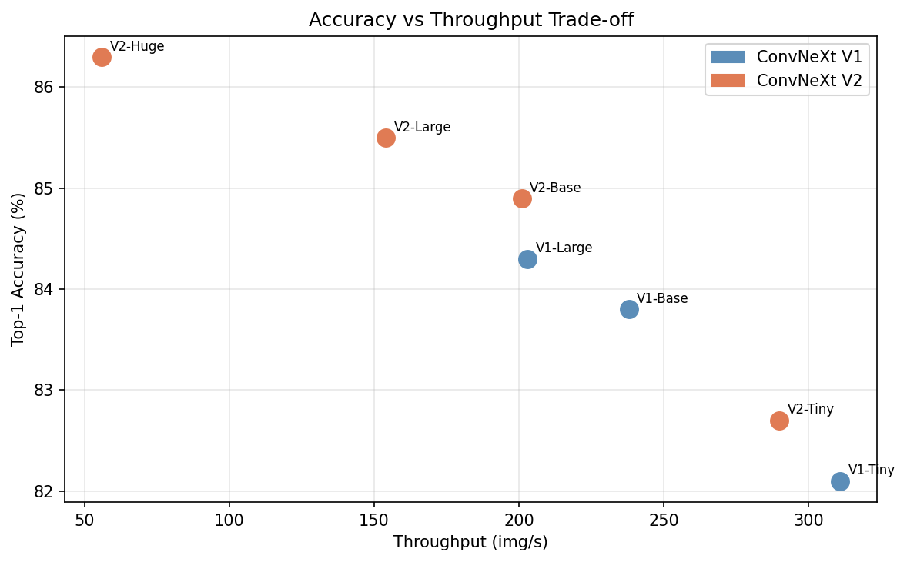
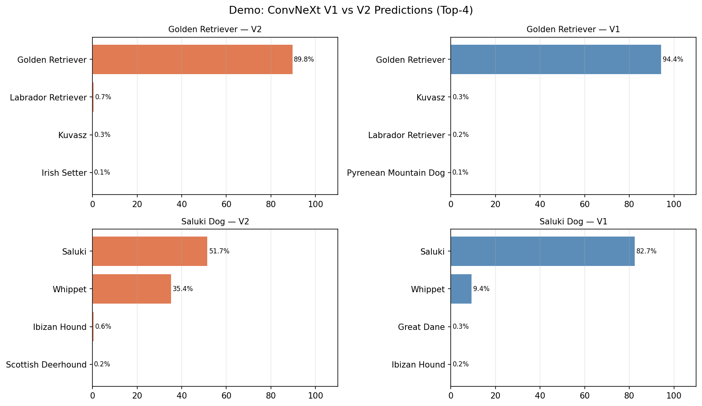
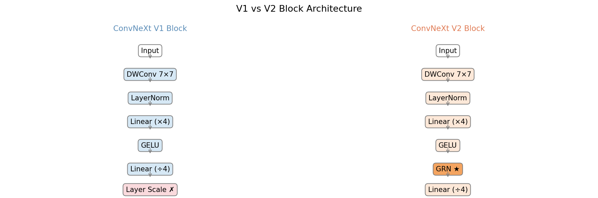
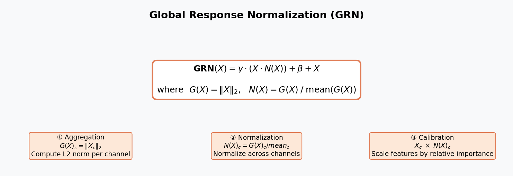
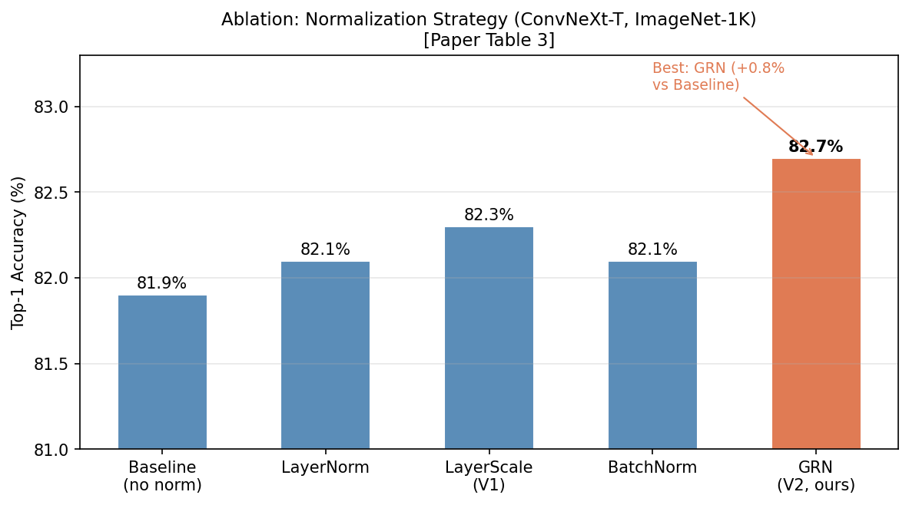
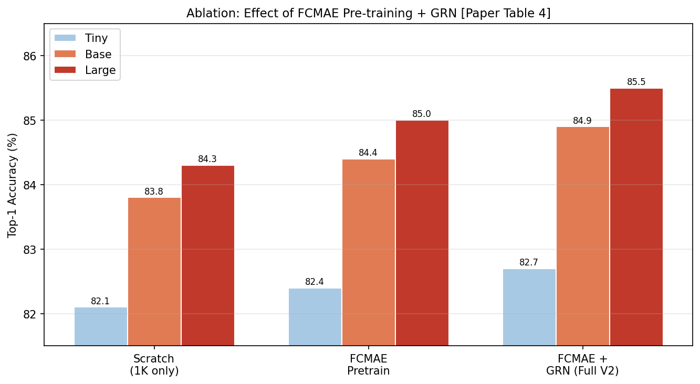

# ConvNeXt V2 Experiments

ConvNeXt V2: Co-designing and Scaling ConvNets with Masked Autoencoders ([논문](https://arxiv.org/abs/2301.00808) / [원본 레포](https://github.com/facebookresearch/ConvNeXt-V2))

## 실험 구성

| 실험 | 설명 |
|------|------|
| ImageNet Classification | ConvNeXt V2-Huge 논문 수치 재현 |
| V1 vs V2 비교 | 동일 크기 모델 성능 및 처리 속도 비교 |
| Demo | 커스텀 이미지 추론 |

## 주요 결과

### 전체 모델 크기 재현 결과

| 모델 | 재현 Top-1 | 논문 Top-1 | 차이 |
|------|-----------|-----------|------|
| V2-Tiny  | 82.67% | 82.7% | -0.03% |
| V2-Base  | 84.73% | 84.9% | -0.17% |
| V2-Large | 85.56% | 85.5% | +0.06% |
| V2-Huge  | 86.13% | 86.3% | -0.17% |



### ConvNeXt V1 vs V2 비교 (Large 기준)

| 지표 | V1 | V2 | 개선 |
|------|----|----|------|
| Top-1 Accuracy | 84.17% | **85.56%** | **+1.39%** |
| Top-5 Accuracy | 96.84% | 97.55% | +0.71% |
| 파라미터 수 | 197.8M | 198.0M | 거의 동일 |
| 처리 속도 | 203 img/s | 154 img/s | -50 img/s |





### Demo 결과 (V1 vs V2 예측 비교)



## GRN 분석

### Block 구조 비교



### GRN 수식



## Ablation Study

### Normalization 전략 비교 (논문 Table 3)



### FCMAE 사전학습 효과 (논문 Table 4)



## 핵심 기여 (논문 요약)

### 1. FCMAE (Fully Convolutional Masked Autoencoder)
- 자기지도학습 사전학습 프레임워크
- 기존 MAE를 ConvNet에 맞게 재설계

### 2. GRN (Global Response Normalization)
- V1의 Layer Scale을 대체하는 새로운 정규화 레이어
- 채널 간 feature 경쟁을 강화하여 표현력 향상

```
V1 Block: DWConv → LN → MLP → LayerScale
V2 Block: DWConv → LN → MLP → GRN        ← 핵심 차이
```

## 설치

```bash
pip install torch torchvision
```

## 사용법

### 1. 체크포인트 다운로드
```bash
# V2 Huge만
python download_checkpoints.py --model convnextv2_huge_1k_224 --version v2

# V1, V2 전체
python download_checkpoints.py --version both
```

### 2. ImageNet 평가
```bash
python eval_imagenet.py \
  --model convnextv2_huge \
  --checkpoint checkpoints/convnextv2_huge_1k_224.pt \
  --data_path /path/to/imagenet \
  --gpu 0
```

### 3. V1 vs V2 비교
```bash
python compare_v1_v2.py \
  --size large \
  --data_path /path/to/imagenet \
  --gpu 0
```

### 4. 데모
```bash
# 단일 이미지
python demo.py \
  --image path/to/image.jpg \
  --checkpoint checkpoints/convnextv2_large_1k_224.pt \
  --gpu 0

# V1 vs V2 나란히 비교
python demo.py \
  --image path/to/image.jpg \
  --checkpoint checkpoints/convnextv2_large_1k_224.pt \
  --v1_checkpoint checkpoints/convnext_large_1k_224.pt \
  --compare \
  --gpu 0
```

## 파일 구조

```
ConvNeXt-V2/
├── models/
│   ├── convnextv2.py      # ConvNeXt V2 (GRN 포함)
│   ├── convnextv1.py      # ConvNeXt V1 (비교용)
│   └── utils.py           # LayerNorm, GRN, DropPath
├── results/               # 실험 결과
├── download_checkpoints.py
├── eval_imagenet.py
├── compare_v1_v2.py
└── demo.py
```

## 환경

- Python 3.10
- PyTorch 2.1.0
- NVIDIA RTX A6000 (48GB) × 1

---

## 구현 중 막혔던 문제들 및 해결 방법

### 1. `timm` 패키지 의존성 문제
**문제:** 원본 레포의 `convnextv2.py`는 `from timm.models.layers import trunc_normal_, DropPath`를 사용하나, 서버 환경에 `timm`이 설치되어 있지 않았음.

**해결:** `trunc_normal_`과 `DropPath`를 직접 구현하여 외부 의존성 없이 동작하도록 `models/utils.py`에 작성.

```python
def trunc_normal_(tensor, mean=0., std=1., a=-2., b=2.):
    # timm 없이 직접 구현
    with torch.no_grad():
        l = math.erf((a - mean) / (std * math.sqrt(2))) / 2 + 0.5
        ...
```

---

### 2. ConvNeXt V1-Huge 체크포인트 다운로드 실패 (HTTP 403)
**문제:** V1 vs V2 비교를 위해 V1-Huge 체크포인트를 다운로드하려 했으나 `HTTP Error 403: Forbidden` 발생.

```
urllib.error.HTTPError: HTTP Error 403: Forbidden
```

**원인 파악:** ConvNeXt V1은 Tiny/Small/Base/Large까지만 ImageNet-1K 체크포인트가 공개되어 있고, Huge 모델의 1K 체크포인트는 공개되지 않음. V1-Huge는 22K 사전학습 모델만 존재.

**해결:** V1 vs V2 비교를 Large 기준으로 진행. 오히려 이를 통해 *"V1은 Huge 스케일의 1K 학습이 불안정했던 반면, V2는 FCMAE 덕분에 Huge까지 안정적으로 확장 가능"* 이라는 논문의 핵심 주장을 확인.

---

### 3. 다운로드 progress 출력으로 인한 background 프로세스 실패
**문제:** `urllib.request.urlretrieve`의 `reporthook`이 `\r`(carriage return) 기반 progress를 매우 빠르게 출력하여 로그 파일이 14.8MB로 커지며 프로세스가 강제 종료됨.

**해결:** 이후 다운로드 시 `reporthook` 없이 조용하게 실행하는 방식으로 수정.

```python
# reporthook 제거 후 조용하게 다운로드
urllib.request.urlretrieve(url, filename)
```

---

### 4. Demo 추론 시 CPU/GPU 텐서 불일치 오류
**문제:** 이미지 추론 시 아래 오류 발생.

```
RuntimeError: Input type (torch.FloatTensor) and weight type
(torch.cuda.FloatTensor) should be the same
```

**원인:** `transform(img)`로 만든 이미지 텐서가 CPU에 있는 상태에서 GPU에 올라간 모델에 바로 입력한 것.

**해결:** `predict()` 함수에서 추론 전 텐서를 device로 이동.

```python
def predict(model, image_tensor, device, labels, topk=5):
    image_tensor = image_tensor.to(device)  # 추가
    logits = model(image_tensor.unsqueeze(0))
    ...
```

---

### 5. GRN 채널 시각화의 한계
**시도:** V1(LayerScale)과 V2(GRN)의 채널 활성화 다양성 차이를 시각화하여 GRN의 효과를 보여주려 함.

**결과:** 파인튜닝된 모델에서는 V1/V2 모두 dead channel 0%로 차이가 나타나지 않음.

**원인 분석:** 논문에서 feature collapse 문제는 FCMAE **사전학습 중**에 발생하는 현상임. 이미 파인튜닝이 완료된 모델에서는 두 모델 모두 수렴된 상태여서 차이가 관측되지 않음.

**결론:** 파인튜닝 후 모델로 GRN 효과를 시각화하는 것은 적절하지 않음. 해당 시각화는 제외하고 논문의 ablation 수치로 대체.
